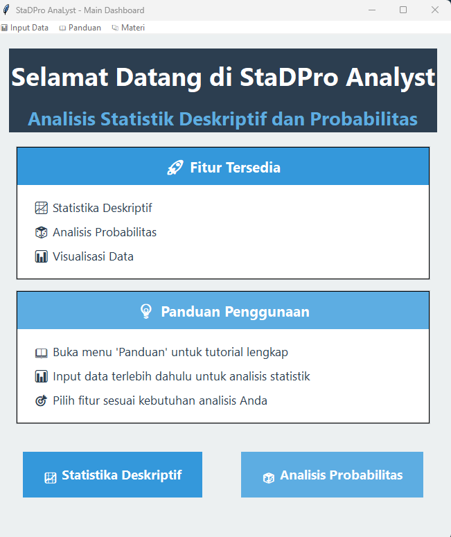
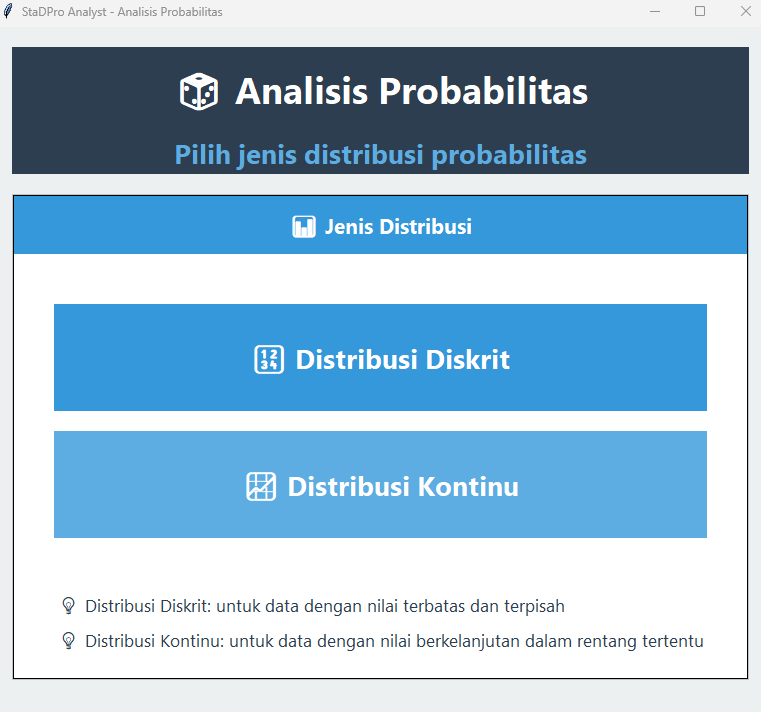
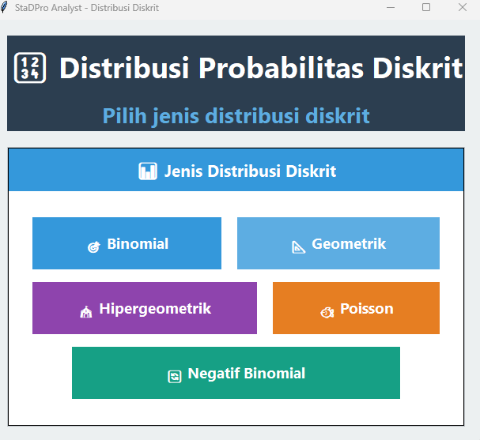
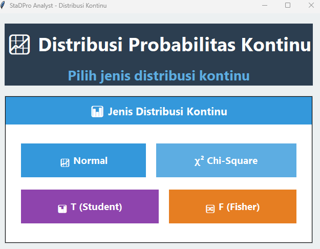

# 📊 StaDPro Analyst

**StaDPro Analyst** adalah aplikasi analisis statistik berbasis GUI yang dibuat menggunakan bahasa pemrograman **R**. Aplikasi ini memudahkan pengguna dalam melakukan **Analisis Statistika Deskriptif** dan **Analisis Probabilitas** dengan antarmuka yang interaktif dan intuitif.

---

## 🧰 Teknologi yang Digunakan

- **Bahasa Pemrograman:** R
- **Library Utama:**
  - `tcltk` – untuk membangun antarmuka GUI
  - `tcltk2` – elemen GUI tambahan
  - `DescTools` – perhitungan statistik deskriptif

---

## 🎯 Fitur Utama

### ✅ Statistika Deskriptif

- Menghitung nilai rata-rata, median, modus, varians, standar deviasi, dll.
- Hasil analisis ditampilkan langsung melalui GUI.

### 🎲 Analisis Probabilitas

**Distribusi Diskrit:**

- Binomial
- Geometrik
- Hipergeometrik
- Poisson
- Negatif Binomial

**Distribusi Kontinu:**

- Normal
- Chi-Square (χ²)
- T (Student)
- F (Fisher)

### 📊 Visualisasi Data

- Menampilkan representasi visual seperti histogram dan grafik batang (fitur tambahan jika tersedia).

---

## 📥 Input Data

- **Manual:** Data dapat diketik langsung melalui form GUI.
- **Import File:**
  - Mendukung file **CSV (.csv)** dan **Excel (.xlsx)**
  - Header pada baris pertama sangat disarankan
  - Format data tabular (kolom variabel)

---

## 📚 Panduan Penggunaan

1. Buka file `StaDPro_Analyst.R` menggunakan R atau RStudio.
2. Jalankan seluruh skrip:
   ```r
   source("StaDPro_Analyst.R")
   ```
3. GUI akan muncul secara otomatis.
4. Masukkan data secara manual atau import file.
5. Pilih fitur analisis yang diinginkan.
6. Hasil akan ditampilkan di jendela GUI.

---

## 🧑‍💻 Tim Pengembang

| Nama                       | NIM       |
| -------------------------- | --------- |
| Nur Azizah                 | 188221016 |
| Ezha Easyfa Wieldyanisa    | 188221080 |
| Yoga Setya Wibawa          | 188221095 |
| Riezqi Dhermatria Rachmadi | 188221100 |

---

## 🧑‍🏫 Dosen Pengampu

- Dr. Nur Chamidah, S.Si., M.Si
- Dr. Toha Syaifudin, S.Si., M.Si

---

## 📸 Screenshot Aplikasi

| Dashboard                               | Analisis Probabilitas                         | Distribusi Diskrit                  | Distribusi Kontinu                  |
| --------------------------------------- | --------------------------------------------- | ----------------------------------- | ----------------------------------- |
|  |  |  |  |

---

## 🚀 Instalasi & Menjalankan

### 1. Clone Repo

```bash
git clone https://github.com/Rzq12/College-Project.git
cd StadPro-Analyst
```

### 2. Instalasi Package di R

```r
install.packages("tcltk2")
install.packages("DescTools")
```

> Package `tcltk` sudah tersedia secara default di R (Windows).

### 3. Jalankan Aplikasi

```r
source("StaDPro_Analyst.R")
```

---

## 📄 Lisensi

Aplikasi ini dibuat untuk keperluan akademik dan pembelajaran. Bebas digunakan dan dimodifikasi dengan mencantumkan kredit kepada pengembang.

---

## 💬 Kontak

Untuk pertanyaan dan kontribusi, silakan buka _issue_ atau _pull request_ di repositori ini.
